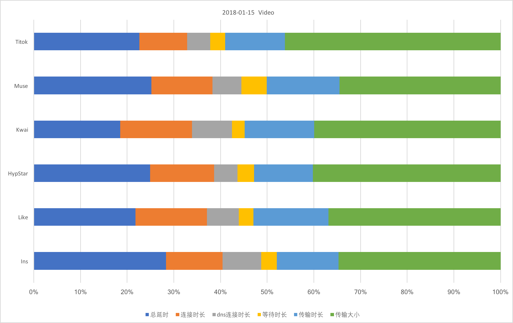
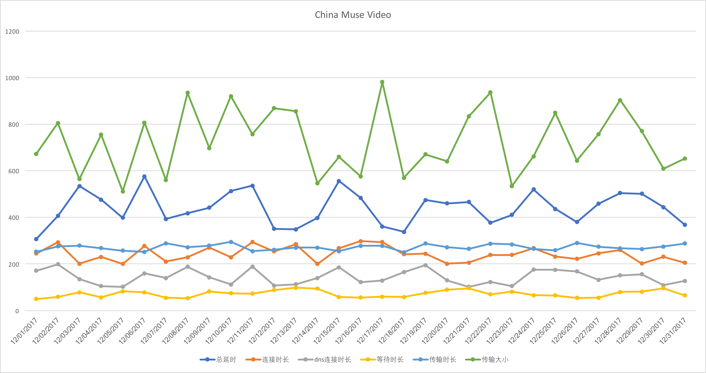

### 图表需求

+ 按天维度
    + 选择器
        1. 国家(CHINA,USA,INDIA)
        2. 数据类型（VIDEO,FEED,IMAGE）
    + Demo(产品横向比较)
    
+ 按产品维度
    + 选择器
        1. 国家(CHINA,USA,INDIA)
        2. 数据类型(VIDEO,FEED,IMAGE)
    + Demo(趋势比较)
    

+ 趋势图计算逻辑（当前已完成）
    1. 提取文件中所有的数据
    2. 按照国家，产品，统计类型做聚合取平均数
    

